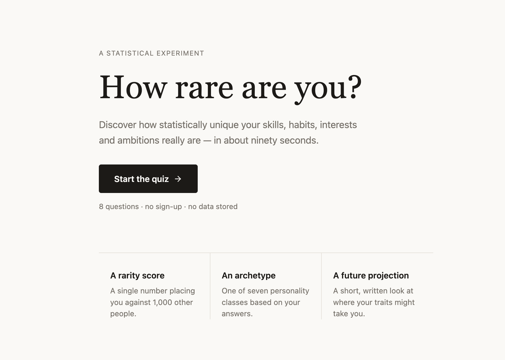
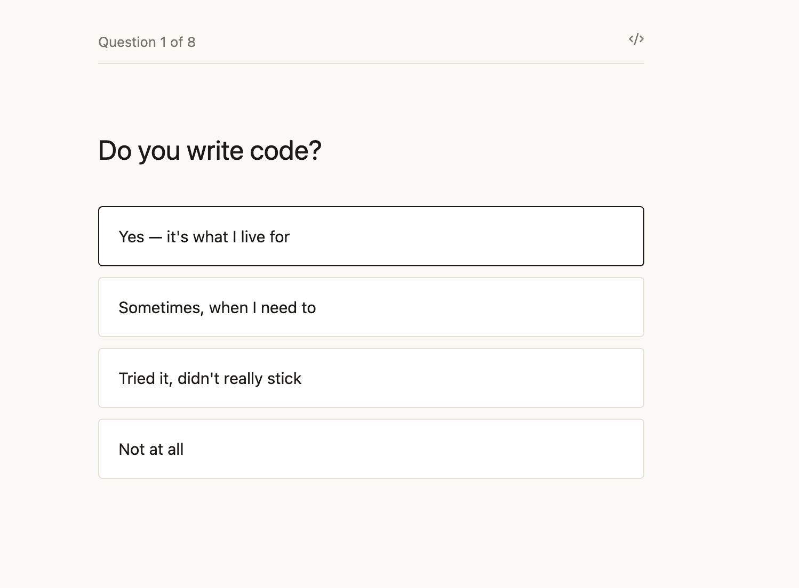
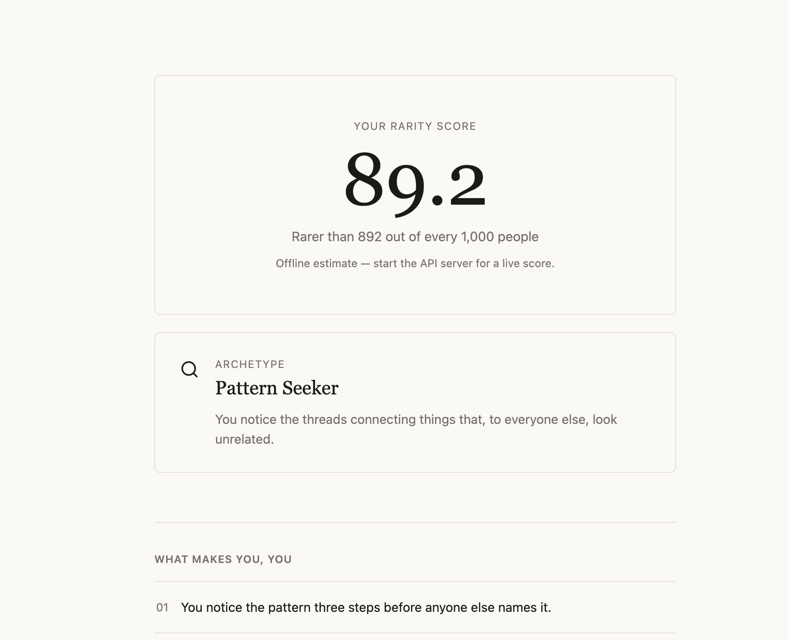

How Rare Are You?

> *What if your hobbies, habits, and ambitions could tell a story about who you are?*

That's exactly what **How Rare Are You?** tries to answer.

Most personality quizzes ask a few questions and throw you into a random category.

I wanted to build something that felt different.

Something that actually makes you stop and think.

So I built **How Rare Are You?** — an AI-powered experience that looks at your interests, skills, and habits to estimate just how unique your profile is.

Will it tell you you're the next Steve Jobs?

Probably not.

Will it make you say *"Wait... that's actually me."*?

Hopefully. 

---

#  How It Works

The journey is pretty simple.

### Step 1

Answer a series of questions about yourself.

Things like:

 Do you code?
 Do you read books?
 Do you play an instrument?
 Do you work out?
 Do you build projects?
 Are you interested in entrepreneurship?

Nothing too serious.

Just tell the app a little about yourself.

---

### Step 2

Now the fun begins.

Behind the scenes the application starts analyzing your profile.

It looks at all of your answers and asks questions like:

> How common is this combination?

> What kind of person does this resemble?

> What patterns stand out?

---

### Step 3

A few seconds later...

You get your own personalized report.

Not just a number.

An actual explanation.

---

#  Your Report Includes

 A Rarity Score

Find out how unique your overall profile is.

---

 Your Archetype

Every user is matched with a personality archetype based on their interests and habits.

Maybe you're a:

 Visionary Builder
 Explorer
 Scholar
 Athlete

Or something completely different.

---

 Personalized Insights

Small observations that explain what makes your profile interesting.

Sometimes they're surprisingly accurate.

Sometimes they make you question your life choices.

---

 AI Personality Analysis

This is my favorite part.

Instead of reading generic text, the AI looks at your profile and writes a personalized analysis describing your strengths, mindset, and the kind of opportunities that might suit you.

---

 Future Projection

Based on everything you've shared, the AI also predicts where your current habits and interests could take you in the future.

No crystal ball.

Just a little educated guessing.

---

#  Why I Built This

Honestly?

Because I thought it would be cool.

I love building projects that mix traditional programming with AI, and this felt like the perfect excuse to experiment with both.

The goal was never to create another boring personality quiz.

I wanted something that feels interactive, colorful, and just a little addictive.

Something you'd immediately send to a friend and say,

*"You have to try this."*

---

#  A Tiny Disclaimer

I am basically using the free version of render and it might take some time to work 

---

#  What's Next?

There are still plenty of ideas I'd love to explore:

 Better rarity calculations
 More personality archetypes
 Shareable report cards
 Real user percentile rankings
 AI chat with your own profile
 Even more beautiful animations

This is only Version 1.

---

#  Thanks for Stopping By

If you enjoyed the project, found a bug, or have an idea that could make it even more fun, I'd love to hear it.

And if your rarity score ends up being ridiculously high...

Try not to let it get to your head. 
